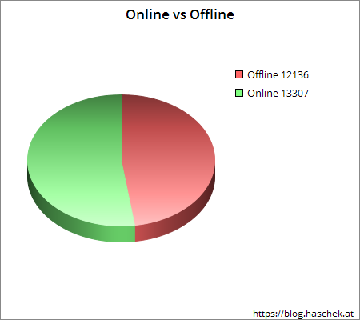
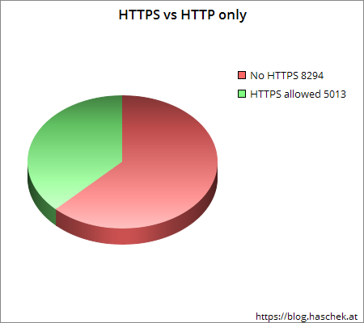
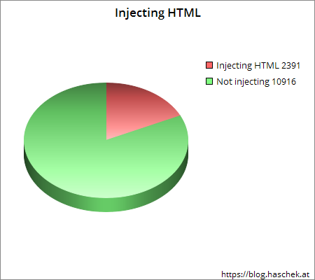
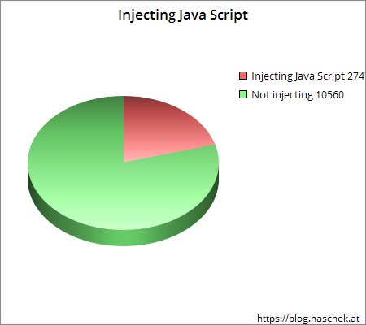
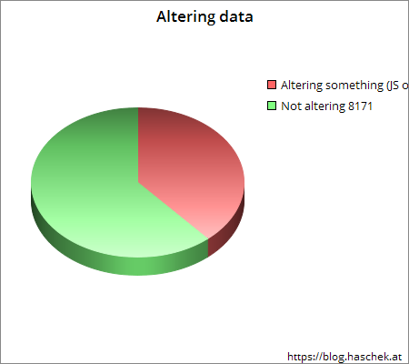
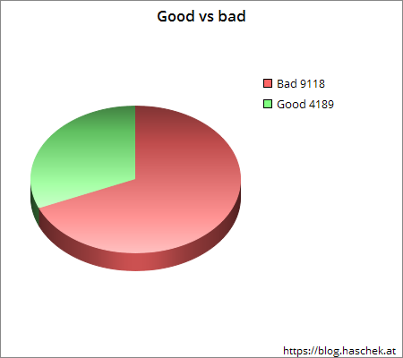

## 0x00 概述

当你用网上找的免费代理翻越高墙、爬数据的时候，你心里肯定有个疑问：“为什么会有免费的代理，他们图什么呢？”

如果我们是黑帽子，在网上放出这种免费的代理，你会干什么坏事？

1，查看内容

因为你的流量都要经过我的代理服务器，自然而然我能轻松的查看你在浏览哪些网页，包括那些需要会话授权的网页，比如你的私人gmail邮箱等等。受害者难以发觉。

2，窃取会话

能够拿到cookie，获得对话是轻松的。账号密码也可以批量获取，只要在代理中过滤出那些提交的form中有password type的内容。如果将代理设置为对某些服务的专门加速代理，那就还可以获取特定服务的账号密码了。

3，注入代码

注入广告代码来获取广告费，注入僵死代码来在社交网络上建粉丝，注入挖矿代码等等

使用代理基本就等于对代理的背后控制者敞开大腿了。

有位haschek这位小哥也有这个疑问，他做了个分析。我们从网上各种地方**25443**个所谓的免费代理，用我们的扫描器扫一遍，发现如下结果：

## 0x01 代理的可用性

超过50%的免费代理是 在线可用的。

 ## 0x02 HTTP vs HTTPS

大部分的代理禁止了https的链接。而http链接下，代理的控制者可以随意查看你提交的照片、账号密码等所有数据。

## 0x03 注入

注入html代码

注入js代码

替换内容

## 0x04 未发现异常的vs坏的

可见的变更内容大部分都是坏的，例如插入广告，其中一部分还有恶意行为。但也有1/4的代理为发现异常，但这并不表明，它就是好的，其拥有者依旧能够窥探你的数据，只是表面上发现不了而已。

## 0x05 总结

别使用网上的免费代理干正事，包括那些你原本想用代理隐藏的事情，因为你的所作所为代理的控制者都看的一清二楚，而且他们往往就是怀着这种目的开设免费代理的。

(1)检查代理是否更改数据的工具https://proxycheck.haschek.at/

(2)原始数据https://blog.haschek.at/2015-lets-analyze-twenty-thousand-proxies

