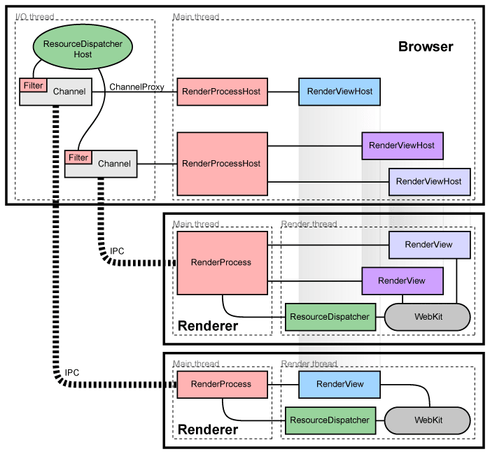

前几天我用Electron做了个工具[OpenWebMonitor](openwebmonitor.netqon.com)，代码在[这里[(https://github.com/fateleak/openwebmonitor)。我在main process里面跑定时监控任务，我发现当任务量很大时（例如：大于200个目标要在15分钟内检查），UI会出现卡顿，卡住时整个APP的UI无响应。[卡顿的示例代码](3/code/)


### 为什么会发生这种情况？

Electron的UI窗口是跑在另一个进程中的，主进程busy时，为什么在UI进程的渲染工作会被阻塞呢？我们的UI进程和主进程是有ipc通信的，但这个通信在UI端看来都是异步的，当主进程busy时，也并不会导致阻塞的啊，真奇怪。

### 真正的原因是？

先看下chromium的架构图，每个渲染进程都有一个全局对象RenderProcess，用来管理与父浏览器进程的通信，同时维护着一份全局状态。浏览器进程为每个渲染进程维护一个RenderProcessHost对象，用来管理浏览器状态和与渲染进程的通信。浏览器进程和渲染进程使用 Chromium 的 IPC 系统进行通信。



实际的原因正是和其中的IPC有关，**在chromium中，页面渲染时，UI进程需要和main process不断的进行sync IPC，若此时main process忙，则UI process就会在IPC时阻塞。**


UI process在渲染时的ipc在搞什么？我也不知道，读者可以看看chromium的代码。


### 永远不要让主进程busy，怎么做?

马上能够想到：为了不让主进程busy，**必须让有工作量的任务变成异步的**，例如：

- 请求网页时，不用`[sync-request](https://www.npmjs.com/package/sync-request)`而是用异步的`request`。

- 读取文件时，不用`fs.readFileSync('input.txt')`，而是`fs.readFile('input.txt', function (err, data) {}`

等等


### Node.js是单线程的，那么`异步`=`不阻塞`？

Node使用了libuv库做所有的I/O操作，libuv库依赖于操作系统提供的支持。简单的说，当你需要读文件时，告诉系统我要读A文件后，马上就可以去做别的事情了，操作系统会把A文件的数据准备好后，再通知你享用数据。于是，该线程并不会阻塞在I/O上。


### But，事儿并没有那么简单！

Node.js作为服务器程序时，在做轻CPU任务，重I/O的任务的服务时，比普通的multi-threaded的服务程序（Apache/IIS等)，在并发上能强上好几倍，这是被证实了的。


**但并不是所有业务都只是I/O啊**，特别在使用Electron做桌面软件时，哪个APP没有一点非IO的计算呢？比如，在我的OpenWebMonitor里面，我们用Google的[diff-match-patch](https://www.npmjs.com/package/diff-match-patch)来做类似`git diff`的业务，它就是一个典型的CPU密集型任务，从它的API上就可以看出端倪，它没有CALLBACK！！！

```
const dmp = new DiffMatchPatch()
const diff = dmp.diff_main('dogs bark', 'cats bark')
```
**在当时你可能很开心😊，终于碰到个API不是回调的了，但实际上你得格外小心才对，因为它会导致你的APP卡顿。**


### 如何在electron中不卡顿地执行CPU密集型任务？

如果面试官问你，node.js有多线程吗，你可以确切的告诉他：
多线程是没有的，多进程是有的，你可以看看nodejs的`cluster` 模块。

但**在electron中还有另一个方法来实现多线程，那就是[web worker](https://electronjs.org/docs/tutorial/multithreading)。**

    Web Workers is a simple means for web content to run scripts in background threads. The worker thread can perform tasks without interfering with the user interface. In addition, they can perform I/O using XMLHttpRequest (although the responseXML and channel attributes are always null). Once created, a worker can send messages to the JavaScript code that created it by posting messages to an event handler specified by that code (and vice versa.) This article provides a detailed introduction to using web workers.

不过，用Web workder的方法是有**局限**的：
- Web worker是位于UI进程的，并不能在main进程里面使用。
- Web worker内的js可以使用node集成，但是会不稳定，因为大部分的node包开发时并不是线程安全的。因而，最好不要在多个worker内使用相同的node package。


**最后我的方法是，把CPU密集型的后台任务放到一个预加载的tray窗口的Web worker中，以此来解决UI卡顿问题。**


#### 参考学习
https://www.zcfy.cc/article/multi-process-architecture-the-chromium-projects
http://dev.chromium.org/developers/design-documents/inter-process-communication
http://dev.chromium.org/developers/design-documents/displaying-a-web-page-in-chrome
https://twitter.com/NumaanAshraf/status/968496732278374400
https://medium.com/actualbudget/the-horror-of-blocking-electrons-main-process-351bf11a763c
